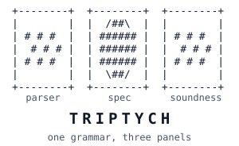

# Triptych



Triptych is a Lean 4 grammar-to-parser compiler for flat, non-recursive string formats. From one
grammar, it generates a readable specification, a verified parser, and machine-checked
correctness theorems.

For more details, see the [Triptych documentation](https://cruisesong7.github.io/triptych/).

## Build

```sh
lake build
```
